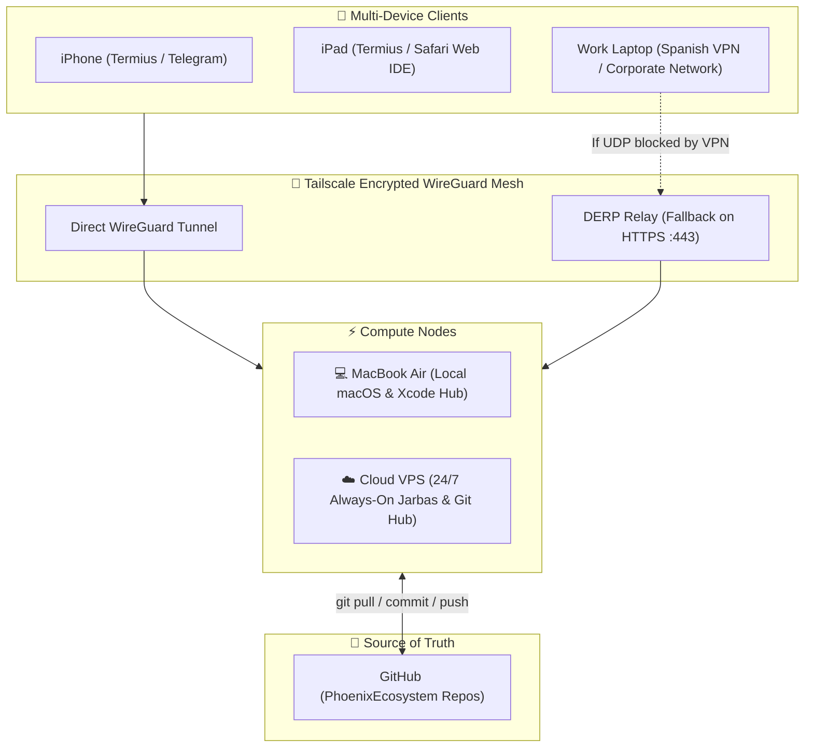

# Omni-Channel Remote Architecture & Sync Guide

This guide documents the multi-device, always-on development infrastructure for the **Phoenix Ecosystem**, enabling seamless remote development and AI agent orchestration from any device, anywhere.

---

## 🌐 System Topology Overview

Whether working on your **MacBook Air**, mobile from your **iPhone / iPad**, or restricted behind a corporate **Spanish VPN**, all nodes connect through an encrypted mesh network with GitHub as the single source of truth.



---

## 🛠️ Installed Systems Reference

The following core systems have been configured for remote access:

### 1. Tailscale Private Mesh VPN
* **Function**: Creates a secure, private peer-to-peer WireGuard network connecting all your devices without opening ports on your home router.
* **Mac Node**: `Gabriels-MacBook-Air` (IP: `100.x.y.z`)
* **Features**:
  * **MagicDNS**: Allows connecting by hostname (`ssh gabrielnetto@gabriels-macbook-air`).
  * **DERP Relays**: Automatically tunnels encrypted traffic over HTTPS (port 443) if a corporate/Spanish VPN blocks direct UDP peer connections.

### 2. Termius (Mobile & Tablet SSH Terminal)
* **Function**: High-performance SSH client on iOS, iPadOS, macOS, and Windows.
* **Saved Hosts**:
  * **Host 1 (Local Mac)**: `Gabriels-MacBook-Air` / Tailscale IP — User: `gabrielnetto`
  * **Host 2 (Cloud VPS)**: `phoenix-vps` / Tailscale IP — User: `root` / `ubuntu`
* **Features**: Cloud snippet sync, background connection persistence, and terminal keys tailored for mobile.

### 3. macOS Native Remote Services
* **Remote Login (SSH)**: Enabled in *System Settings > General > Sharing > Remote Login*.
* **Screen Sharing (VNC)**: Enabled for full desktop GUI access from iPad / iPhone VNC Viewer.
* **Power Management (`caffeinate`)**:
  ```bash
  # Prevent sleep while keeping screen dark
  caffeinate -d -s &
  pmset displaysleepnow
  ```

---

## 🌍 Connecting Across Different Environments

### A. From iPhone / iPad (Cellular 4G/5G or Remote Wi-Fi)
1. Turn **Tailscale VPN** ON in iOS Settings.
2. Open **Termius** > Tap **`Gabriels-MacBook-Air`** or **`phoenix-vps`**.
3. You have instant shell access with persistent terminal history.

### B. From Work Laptop Behind a Strict / Spanish VPN
Corporate VPNs often restrict custom ports and block peer-to-peer UDP. Here is how seamless connection is guaranteed:
1. **Tailscale DERP Traversal**: Tailscale will automatically route traffic over port `443` (standard HTTPS), allowing connection even through aggressive firewalls.
2. **Web IDE (code-server)**: If SSH is blocked on the corporate machine, open a browser tab to `https://vps.your-tailnet.ts.net:8443` to get a full VS Code / Antigravity editor in Chrome/Safari.
3. **GitHub Codespaces**: Open your repository on GitHub and launch a cloud Codespace directly in the browser with zero local installation required.

---

## 🔄 Universal Multi-Device Synchronization Workflow

To ensure code never gets out of sync across your Mac, VPS, iPad, and iPhone:

```
                  ┌──────────────────────┐
                  │   GitHub (origin)    │
                  └──────────┬───────────┘
                             │
            ┌────────────────┴────────────────┐
            ▼                                 ▼
   ┌─────────────────┐               ┌─────────────────┐
   │   MacBook Air   │               │    Cloud VPS    │
   │  (Xcode / Mac)  │               │ (24/7 Headless) │
   └─────────────────┘               └─────────────────┘
```

1. **Before starting work on any device**:
   ```bash
   git pull --rebase
   ```
2. **After making changes with Jarbas**:
   ```bash
   git add .
   git commit -m "feat(module): description of changes"
   git push origin main
   ```
3. **Auto-Fetch Reminder**: Add the following alias to your `~/.zshrc` on all machines to quickly sync:
   ```bash
   alias psync="git pull --rebase && git push"
   ```

---

## 🛡️ Security & Reliability Checklist

* [x] **SSH Keys Only**: Disable password login on cloud servers in favor of Ed25519 SSH keys.
* [x] **Tailscale ACLs**: Restrict access so only your authenticated devices can communicate.
* [x] **Session Persistence (`tmux`)**: Always run tasks inside `tmux` so network drops from train/mobile towers do not terminate running builds or agent processes.
